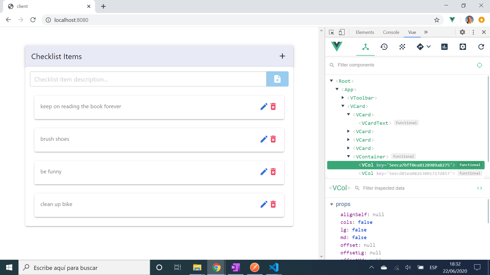
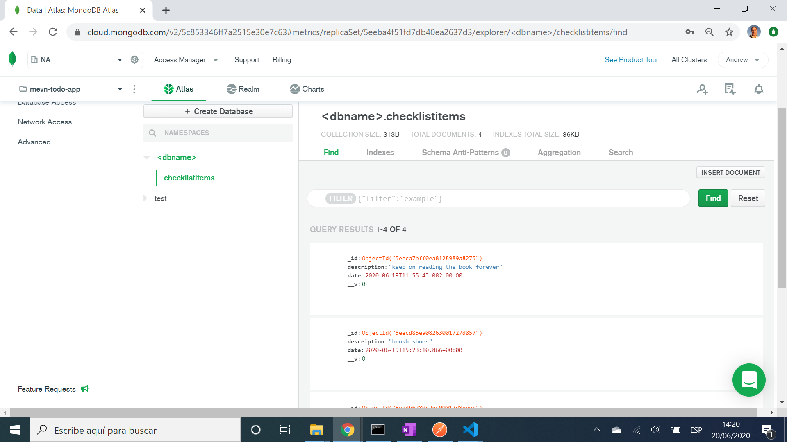

# :zap: MEVN Stack Checklist

* Full stack app using MongoDB, Express, Vue and Node.js to perform Create, Read, Update and Delete (CRUD) operations on a checklist of items.
* **Note:** to open web links in a new window use: _ctrl+click on link_


## :page_facing_up: Table of contents

* [:zap: MEVN Stack Checklist](#zap-mevn-stack-checklist)
  * [:page_facing_up: Table of contents](#page_facing_up-table-of-contents)
  * [:books: General info](#books-general-info)
  * [:camera: Screenshots](#camera-screenshots)
  * [:signal_strength: Technologies](#signal_strength-technologies)
  * [:floppy_disk: Setup](#floppy_disk-setup)
  * [:computer: Code Examples](#computer-code-examples)
  * [:cool: Features](#cool-features)
  * [:clipboard: Status & To-Do List](#clipboard-status--to-do-list)
  * [:clap: Inspiration](#clap-inspiration)
  * [:file_folder: License](#file_folder-license)
  * [:envelope: Contact](#envelope-contact)

## :books: General info

* Axios used to send/receive data from MongoDB backend
* Data displayed using on a View frontend using data-binding and a v-for loop.

## :camera: Screenshots




## :signal_strength: Technologies

**Frontend:**

* [Vue framework v2](https://vuejs.org/)
* [Vue Router v3](https://router.vuejs.org/) the official router for Vue.js
* [Vue CLI v4](https://cli.vuejs.org/)
* [Material UI icons](https://material.io/resources/icons/?style=baseline)
* [Vuetify colors](https://vuetifyjs.com/en/styles/colors/#colors)
* [Bulma v0.9.2](https://bulma.io/) CSS framework via CDN
* [Axios v0.21.1](https://github.com/axios/axios), a promise-based http client, used to consume API data.
* [Vue DevTools extension for Chrome](https://chrome.google.com/webstore/detail/vuejs-devtools/nhdogjmejiglipccpnnnanhbledajbpd)

**Backend:**

* [Express v4](https://expressjs.com/)
* [Mongoose v5](https://mongoosejs.com/)
* [cors v2](https://www.npmjs.com/package/cors) Cross Origin Resource Sharing Connect/Express middleware
* [Morgan v1](https://www.npmjs.com/package/morgan) HTTP request logger middleware for node.js

## :floppy_disk: Setup

**/client Frontend:**

* `npm run lint` to lint files
* `npm run serve` to run server. Navigate to `http://localhost:8080/`. The app will automatically reload if you change any of the source files. Had to install webpack@4 (i.e. NOT webpack@5), uninstall sass-loader then run `npm install --save-dev sass-loader@10.1.1` and `npm i --legacy-peer-deps` to settle dependency issues. Lots of deprecation warnings during compile. Better to create a new Vue app than to update dependencies in this one.

**/ Backend:**

* Create `.env` file and add `MONGO_URI` and `PORT` - as shown in `.env.example`
* `npm run start` to run node.js server. Navigate to `http://localhost:3000/` to see JSON object with todos or an empty array. CRUD operations can be performed on this backend using the [Postman](https://www.postman.com/) API dev tool.

**/ Full stack:**

* `npm run dev` to run client and backend server concurrently. Navigate to `http://localhost:8080/` to see frontend and `http://localhost:3000/` to see backend.

## :computer: Code Examples

* POST route

```javascript
router.post("/", async (req, res) => {
  const newChecklistItem = new ChecklistItem(req.body);
  try {
    const checklistItem = await newChecklistItem.save();
    if (!checklistItem) throw new Error("Error saving checklist item");
    res.status(200).json(checklistItem);
  } catch (error) {
    res.status(500).json({ message: error.message });
  }
});
```

## :cool: Features

* Front and backends can be run with one command using concurrently set up in package.json

## :clipboard: Status & To-Do List

* Status: Working. Updated june 2021.
* To-Do: Front: change vue-card layout, make into component, add category dropdown and sort by category. Add vuex state management. Unused nav views - use or delete.

## :clap: Inspiration

* [Vue CLI Configuration Reference](https://cli.vuejs.org/config/#devserver-proxy)

## :file_folder: License

* This project is licensed under the terms of the MIT license.

## :envelope: Contact

* Repo created by [ABateman](https://github.com/AndrewJBateman), email: gomezbateman@yahoo.com
